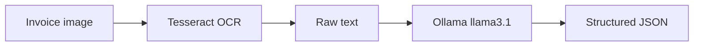

# OCR Invoice Extraction Pipeline

A small Python pipeline that reads an invoice image with Tesseract OCR and asks a local Ollama model to turn the raw text into structured JSON.

## Pipeline



The current extraction schema contains:

- document type;
- date;
- sender;
- total amount;
- key line items.

## Stack

- Python
- Tesseract OCR and pytesseract
- Pillow
- OpenCV for the optional preprocessing script
- Ollama with `llama3.1`
- Requests

## Project structure

| File | Purpose |
| --- | --- |
| `main.py` | Runs OCR, sends the text to the model, and prints the result |
| `extract.py` | Calls Ollama and parses the model response as JSON |
| `preprocess.py` | Creates a thresholded `processed.png` image |
| `ocr_test.py` | Prints the raw Tesseract output |

## Requirements

1. Install [Tesseract OCR](https://github.com/tesseract-ocr/tesseract).
2. Install [Ollama](https://ollama.com/) and download the configured model:

```bash
ollama pull llama3.1
```

3. Create a Python environment and install the packages:

```bash
python -m venv .venv
pip install -r requirements.txt
```

On Windows, activate the environment with `.venv\Scripts\Activate.ps1`. On macOS or Linux, use `source .venv/bin/activate`.

## Run

Place an invoice image named `invoice-sample.jpg` in the repository root, make sure Ollama is running at `http://localhost:11434`, then run:

```bash
python main.py
```

To inspect only the raw OCR result:

```bash
python ocr_test.py
```

To generate a simple black-and-white preprocessed image:

```bash
python preprocess.py
```

## Current limitations

- input paths, the Ollama URL, and the model name are hard-coded;
- the repository does not include an invoice image;
- model output is parsed as JSON but is not validated against a typed schema;
- the Ollama request has no explicit timeout or retry policy;
- preprocessing is a separate experiment and is not called by `main.py`.

These constraints keep the project easy to understand, while showing the complete OCR-to-LLM extraction flow.
